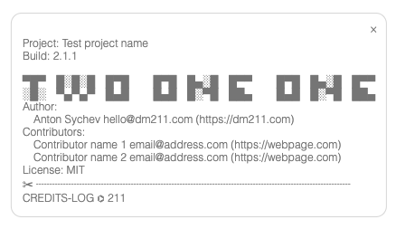

# credits-log 

[](http://opensource.org/licenses/MIT)


***Credits-Log*** is a module / plugin / addon to add in your Vite configuration file. 
The module queries creator and contributor data directly from `package.json`. 

*** Vite / Rollup plugin | so as not to leave the creators in a drawer of oblivion ***


> [!NOTE]
>
>It also saves the Graffiti in as another parameter.
>
>How it works: At compile time a mini function is added with a console.log that just shows the credits in your frontend.


> [!NOTE]
>It contains a CLI application from which you can add, remove or edit data to be displayed.
>The message can have several lines and/or Logo in "ASCII".


## Installation process:
  1) run `npm i credits-log --save-dev` to integrate into your project
     1) Test if CLI version is present if not run `npm link` 
  2) in your project you just have to edit the `vite.config.js` file.

```javascript
//vite.config.json
import creditslog from "credits-log"

export default defineConfig({
    ...
    plugins: [
		    ...
        creditslog()
        ...
    ],
    ...
});
```

## Extension for Front End

Now there is a new parameter to implement: `frontEnd: true`, that when placed in front end pressing the `F1` key will show a floating window with Credits of the project.

```javascript
//vite.config.json
import creditslog from "credits-log"

export default defineConfig({
    ...
    plugins: [
		    ...
        creditslog({
          frontEnd: true
        })
        ...
    ],
    ...
});
```



---

## Parameteres in `package.json`

Read attributes from your `package.json` file:

* `name: ""` (Optional)
* `version: "0.0.1"`
* `"author": "Anton Sychev <anton at sychev dot xyz> https://sychev.xyz` (single line)
* `"author": ["Anton Sychev <anton at sychev dot xyz> https://sychev.xyz", "...other author"],` (multiples authors)
* `"contributors": [
		"name <email> (https://webpage)",
        ...
	]`
* `license: "MIT"`
* Custom fields:
  * `projectName: "Name of your project"`
  * `credits`: [] "New custom parameter for save your ASCII logo / graffiti"


## Cli 

Just run `credits-log` in your project folder

## Links ASCII Generators

In this sites you can create your custom ASCII logotypes
* https://fsymbols.com/generators/carty/
* https://patorjk.com/software/taag/#p=display&f=Abraxis-Small&t=too
* https://manytools.org/hacker-tools/convert-images-to-ascii-art/go/

like this:

```javascript
▀█▀ █░█░█ █▀█   █▀█ █▄░█ █▀▀   █▀█ █▄░█ █▀▀
░█░ ▀▄▀▄▀ █▄█   █▄█ █░▀█ ██▄   █▄█ █░▀█ ██▄
```

```javascript
            -@@@:       =%@@%+                 
            @@@#      =@@@@@@+                
            -@@@#     :@@@@@@-                
             -@@@@+.    =++=.                 
               +@@@@@#+++++++=-.              
                 -*%@@@@@@@@@@@@#:            
                    -@@@@@@@@@@@@%            
                    -@@@@@@@@@%%@#            
                    -@@@@@@@@@*@@:            
                    -@@@@@@@@#%@#             
                    -@@@@@@@@*@@:             
                    -@@@@@@@@##*              
                    -@@@****@@@=              
                    -@@@:  .@@@=              
                    -@@@:  .@@@=              
                    -@@@:  .@@@=              
                    -@@@:  .@@@=              
                    -@@@:  .@@@=   
                    
            Thank you for use [CREDITS-LOG] 
                        ⌬ 211
```

### DOCS

***Rollup.js:***
  * https://rollupjs.org/guide/en/#exporting
  * https://rollupjs.org/guide/en/#a-simple-example
  * https://www.npmjs.com/package/chalk
  * https://github.com/sindresorhus/ora
  * https://github.com/SBoudrias/Inquirer.js/tree/v8.0-legacy

---

### Develop

Run `npm link` in source folder for globaly link this repo 
Man generator: `$ npm run man`

---

### NPM Publish

Local NPM publish command: `npm publish --access=public ./`
CD/CI on push to git, it's automaticaly published to NPM

---

## Star History

[](https://star-history.com/#klich3/credits-log&Date)
